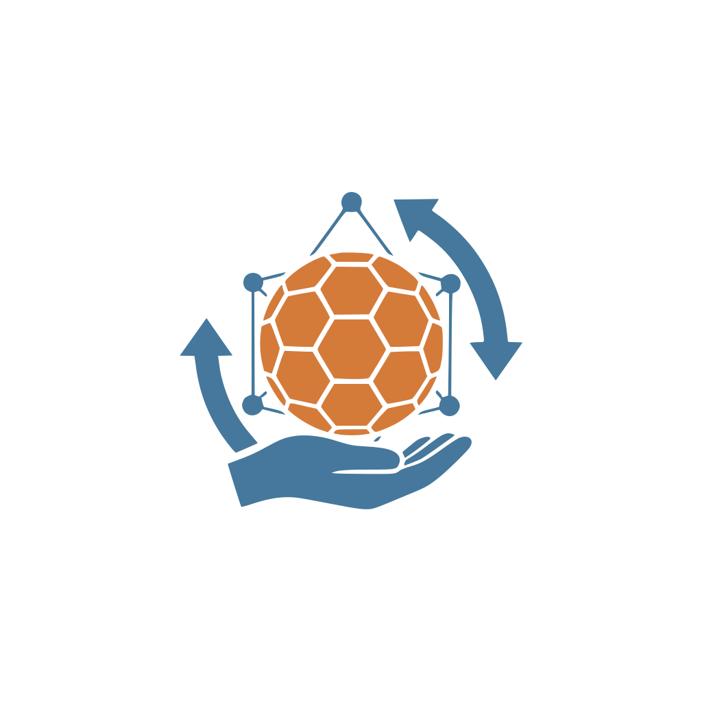

# Handball Season Checks


A compact web app for viewing and analyzing handball season data (DHB). The app provides
a dashboard to search, view and explore teams, matches, lineups and standings.

<p align="center"></p>

## Table of contents
- [Features](#features)
- [Quick start](#quick-start)
- [Development](#development)
- [Project structure](#project-structure)
- [Contributing](#contributing)
- [License](#license)

## Features
- Search clubs and teams
- View lineups (`lineup`), matches (`games`) and standings (`standing`, `table`)
- Responsive Nuxt 3 UI with i18n (German / English)

## Quick start
Clone the repo and install dependencies:

```bash
git clone <repo-url>
cd handball-season-checks
pnpm install
```

Start the dev server:

```bash
pnpm dev
```

Run tests (Vitest):

```bash
pnpm test
```

UI test runner:

```bash
pnpm test:ui
```

## Development
- Build: `pnpm build`
- Preview production build: `pnpm preview`
- Lint: `pnpm lint` / `pnpm lint:fix`

## Project structure
- `app/` — Nuxt application (pages & components)
- `server/api/` — Server endpoints and DHB data adapters
- `tests/` — Unit and component tests
- `types/` — TypeScript type definitions

## Contributing
Contributions are welcome. Please open issues for bugs or feature requests and
create small, focused pull requests.

Before opening a PR:

1. Fork the repository
2. Create a topic branch
3. Commit changes and open a PR

## License
See the `LICENSE` file for licensing details.
